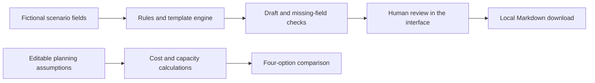

# How the project works

The app has two modes: the original offline workflow simulator, and a saved workspace backed by a Worker API and SQL database. The optional assistant calls OpenAI from the server. It is an independent synthetic portfolio, with no PRG systems connected.

## Code responsibilities

| File | Responsibility |
|---|---|
| `dist/data.js` | Fictional fixtures, 16 opportunity hypotheses, starting cost inputs |
| `dist/engine.js` | Pure functions for trial checks, weighted priority score and commercial arithmetic |
| `dist/app.js` | Page rendering, forms, ephemeral state, review acknowledgement and export |
| `dist/styles.css` | Responsive navy/green interface, keyboard focus and print layout |
| `scripts/serve.cjs` | Optional local static server; no data-processing endpoint |
| `tests/engine.test.cjs` | Business-rule and arithmetic regression checks |

`data.js` and `engine.js` expose browser globals and CommonJS exports so the same business functions can be tested with Node without a build or dependency installation. User-entered values are HTML-escaped before rendering. Downloads use browser Blob URLs.

## Saved workspace architecture

Browser → authenticated Worker API → D1 SQL database. For an assistant request only, the Worker sends permitted context to the OpenAI Responses API and saves a successful reply in SQL. Local development uses the same handler with a SQLite adapter and explicitly simulated identities.

Eight tables store users, drafts, events, business cases, measurements, priority snapshots, assistant messages and daily request counters. Prepared SQL statements bind user inputs. Version-guarded updates and history inserts run in a transaction. All mutating routes require same-origin JSON requests and a custom header. Request bodies are bounded; API responses are private and uncached.

Members access their own drafts. Reviewers and the owner can inspect workspace drafts and approve submitted versions. Only an author can edit their own draft. Editing resets approval; a stale version is rejected. Approved exports are authorised by the server. The owner assigns reviewer/member roles; clients cannot grant themselves administrator access. Personal scenarios, measurements and conversations remain private to their owner.

The assistant receives supplied public source notes, the opportunity hypotheses, up to 12 recent messages and an explicitly selected accessible draft. It has no tools or record-writing authority. Consent, request limits and a bounded response apply before a provider call. Model instructions are guidance, not a guarantee of factual correctness. See [setup and operating guide](SETUP.md).

## Offline mode state and trust boundaries

Inputs and session activity live in memory. Refresh resets them. Exporting explicitly creates a local file; it does not email, upload or update a record. Evidence labels identify synthetic fixtures, not authenticated operational documents. The session activity list is useful for demonstration, not immutable audit evidence.

The review checkbox is a UX control only. A person with browser developer tools could bypass it. It must never be treated as a production security or authorisation mechanism.

## What a future approved integration might require

| Component | Proposed requirement | Status here |
|---|---|---|
| Recruitment system | Confirm licensed functionality first; then approved scoped/read-only access where needed | No connection |
| Communication | Trusted permission/status records; draft-only outputs; human approval | Fictional input field only |
| AI provider | Account credits, approved data and model evaluation | Server integration implemented; real response blocked by exhausted API credits at verification |
| Knowledge | Approved source repository with permissions, citations, freshness and refusal when evidence is absent | Not implemented |
| Automation | Record identity, deduplication, retries, rate limits, approval state and failure handling | Not implemented |
| Audit | Retention, tamper resistance and independent review | SQL actor/version snapshots implemented; not immutable against administrators |
| Deployment | Monitoring, retention and support ownership | Worker/D1 packaging and platform identity implemented; production operations still require review |

The first live connection should follow PRG approval and the scope agreed with the supervisor. A proposed architecture is not evidence that a particular vendor API, plan or permission is available.

## Commercial arithmetic

Priority score = 20 × (0.35 × impact + 0.25 × feasibility + 0.20 × adoption + 0.20 × (6 − risk)). All rubric dimensions are 1–5; risk increases with exposure.

Annual hours = people × tasks per week × working weeks × max(0, gross minutes saved − review minutes) ÷ 60 × adoption fraction.

Year-one cost = setup + training + 12 × (monthly software + monthly support).

Three-year cost = setup + training + 36 × (monthly software + monthly support).

Payback months = upfront costs ÷ ((annual capacity value − annual recurring cost) ÷ 12), only when the denominator is positive. This is a capacity-based planning measure, not a cash-flow forecast.

No price claims are made for named vendors. Costs are illustrative incremental planning assumptions in AUD; no tax, inflation, finance cost, implementation delay, adoption ramp or revenue benefit is included.
